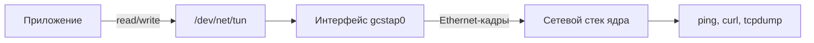
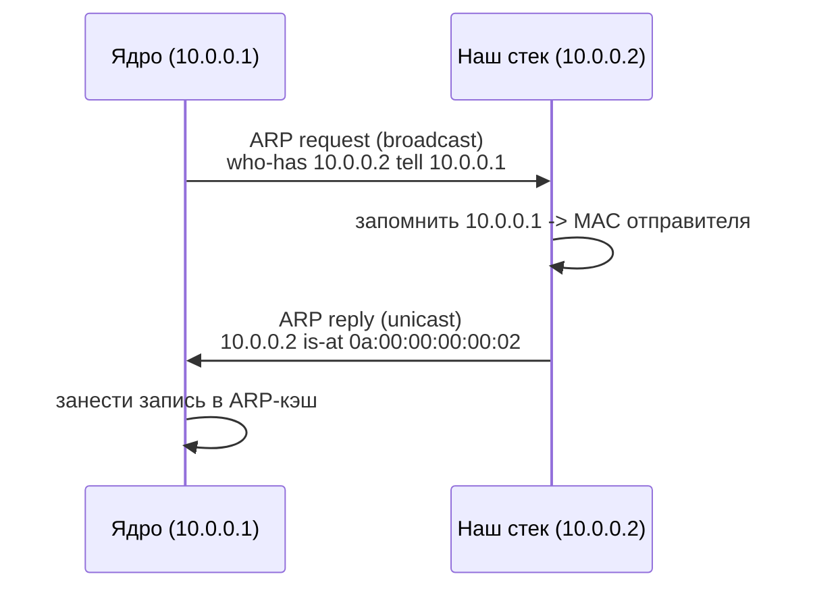
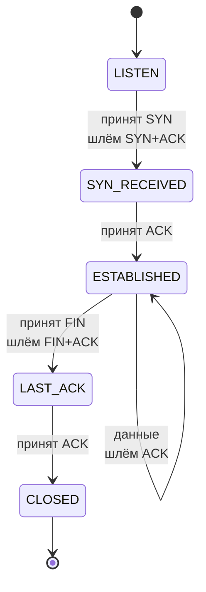

# Как построить стек TCP/IP с нуля

Руководство описывает путь от сырого массива байт до установленного
TCP-соединения. Каждый раздел соответствует одному модулю в `src/`.

## 1. Откуда берутся кадры

Обычная программа работает с сокетами, и ядро само разбирает заголовки.
Чтобы написать стек самому, нужен источник **сырых** кадров. В Linux это
устройство TUN/TAP.



Разница между режимами: TUN отдаёт пакеты уровня IP, TAP — кадры Ethernet
целиком. Нам нужен TAP, потому что мы разбираем и канальный уровень.

```c
ifr.ifr_flags = IFF_TAP | IFF_NO_PI;
strncpy (ifr.ifr_name, requested_name, IFNAMSIZ - 1);

if (ioctl (fd, TUNSETIFF, &ifr) < 0)
{
    /* Без CAP_NET_ADMIN ядро отвечает EPERM. */
    return false;
}
```

`IFF_NO_PI` убирает служебный четырёхбайтовый префикс, который иначе ядро
добавляет перед каждым кадром.

Если привилегии недоступны, стек можно кормить из файла `.pcap`. Именно так
устроен `GCS.Replay`, и это делает прогон детерминированным.

## 2. Ethernet

Заголовок занимает 14 байт: MAC получателя, MAC отправителя, поле типа.

```
 0                   6                  12    14
 +-------------------+-------------------+-----+------------------+
 |     dst MAC       |     src MAC       | тип |    полезная      |
 |     6 байт        |     6 байт        |2 бт |     нагрузка     |
 +-------------------+-------------------+-----+------------------+
```

Поле типа различает вложенный протокол: `0x0800` — IPv4, `0x0806` — ARP.

Важная деталь: минимальный кадр Ethernet равен 60 байтам без контрольной
суммы, поэтому короткие пакеты дополняются нулями. Из этого следует, что
доверять длине кадра при разборе IP нельзя, нужна длина из заголовка IP.

## 3. ARP: как узнать MAC по IP

Чтобы отправить кадр, нужен MAC получателя, а приложение знает только его IP.
ARP закрывает этот разрыв широковещательным вопросом «у кого адрес X».



RFC 826 предписывает сначала попытаться **обновить** существующую запись и
только потом добавлять новую. Этот порядок реализован в
`gcs_arp_table_update`: сначала поиск по IP, затем вставка в свободный слот.

## 4. IPv4 и контрольная сумма

Заголовок IPv4 занимает минимум 20 байт. Поле IHL хранит длину заголовка в
32-битных словах, поэтому его надо умножать на 4.

Контрольная сумма считается по RFC 1071: сумма 16-битных слов в дополнении до
единицы, с переносом старших разрядов обратно в младшие.

```c
uint16_t gcs_checksum_finish (uint32_t sum)
{
    while ((sum >> 16) != 0)
    {
        sum = (sum & 0xFFFF) + (sum >> 16);
    }

    return (uint16_t) (~sum & 0xFFFF);
}
```

Полезное свойство: если посчитать сумму по заголовку, где поле checksum уже
заполнено, результат должен быть нулём. Это превращает проверку в одну строку
и избавляет от необходимости обнулять поле перед пересчётом.

## 5. ICMP и первый видимый результат

Echo reply отличается от echo request всего одним байтом типа: 8 меняется на 0.
Идентификатор, номер последовательности и полезная нагрузка копируются без
изменений, после чего сумма считается заново.

Это первая точка, где работу стека видно снаружи: `ping` начинает отвечать.

## 6. TCP: рукопожатие

TCP хранит состояние, и минимальный сервер живёт в такой части автомата:



Номера последовательности считаются в байтах. SYN и FIN занимают по одной
условной единице, поэтому подтверждение на SYN равно `seq + 1`, а на сегмент
данных — `seq + длина_данных`.

## 7. Контрольная сумма TCP и псевдозаголовок

Здесь чаще всего ошибаются. Сумма TCP считается не только по сегменту, но и по
**псевдозаголовку**, которого нет в самом пакете: адреса отправителя и
получателя, номер протокола и длина сегмента.

```
 +--------------------------------------+
 |         IP отправителя (4 байта)     |
 +--------------------------------------+
 |         IP получателя (4 байта)      |
 +--------+---------+-------------------+
 |  ноль  | протокол|   длина сегмента  |
 +--------+---------+-------------------+
```

Смысл в том, чтобы TCP заметил повреждение адресов в заголовке IP, который
собственной защиты полезной нагрузки не имеет.

```c
uint32_t seed = gcs_pseudo_header_sum (src_ip, dst_ip, GCS_IP_PROTO_TCP, total);
gcs_wr16be (out + 16, gcs_checksum_accum (out, total, seed));
```

## 8. Как это проверять

Два независимых уровня проверки:

1. **Прогон по эталонному захвату.** Захват собирается скриптом
   `tools/gcs_make_sample.py`, стек обрабатывает его и пишет ответные кадры
   в отдельный файл. Результат воспроизводим при каждом запуске.
2. **Чужой анализатор.** `tcpdump -vv` печатает `cksum ... (correct)`, если
   сумма сошлась. Это независимое подтверждение, что кадры настоящие: суммы
   считает не наша программа.

```
$ tcpdump -r data/replies.pcap -n -vv
10.0.0.2.8080 > 10.0.0.1.40001: Flags [S.], cksum 0xcb66 (correct), seq 12648430, ack 1001
```

## Источники

1. RFC 791. Internet Protocol. https://www.rfc-editor.org/rfc/rfc791
2. RFC 792. Internet Control Message Protocol. https://www.rfc-editor.org/rfc/rfc792
3. RFC 793. Transmission Control Protocol. https://www.rfc-editor.org/rfc/rfc793
4. RFC 826. An Ethernet Address Resolution Protocol. https://www.rfc-editor.org/rfc/rfc826
5. RFC 1071. Computing the Internet Checksum. https://www.rfc-editor.org/rfc/rfc1071
6. Saminiir. Let's code a TCP/IP stack. https://www.saminiir.com/lets-code-tcp-ip-stack-1-ethernet-arp/
7. Универсальный каталог проектов build-your-own-x. https://github.com/codecrafters-io/build-your-own-x
